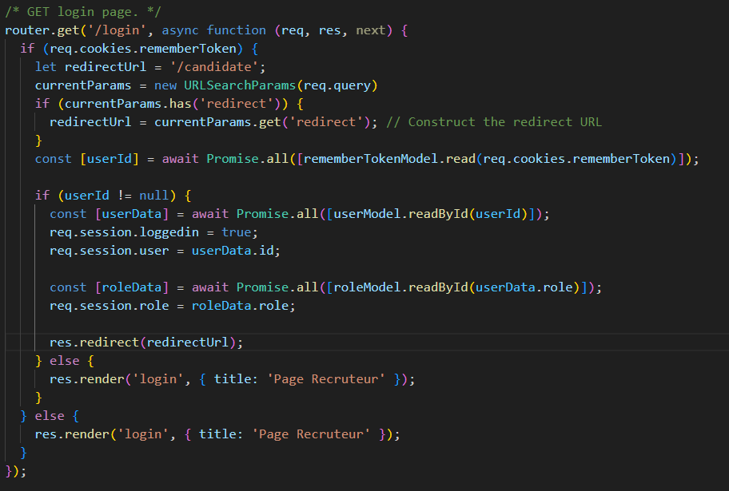
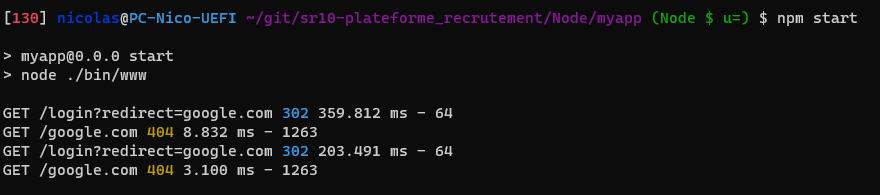
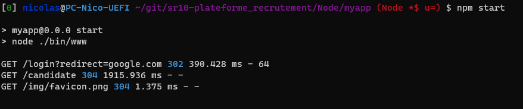
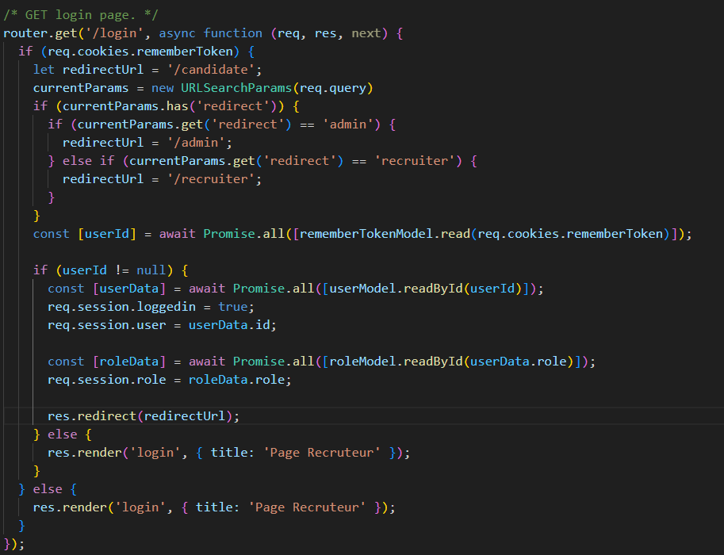
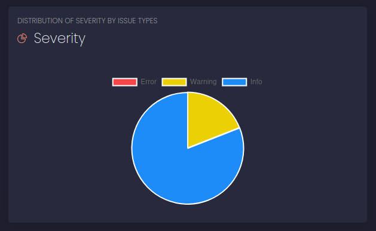

# Rapport de Sécurité
Ce rapport de sécurité met en évidence certaines considérations importantes pour assurer la sécurité de l'application. Les sections suivantes abordent différents aspects de la sécurité.

## Injection SQL
L'injection SQL est une vulnérabilité courante qui peut permettre à un attaquant d'exécuter du code SQL non autorisé dans une application. Pour éviter les injections SQL, nous avons utilisé des requêtes préparées. Nous avons également validé et filtré soigneusement toutes les données utilisateur avant de les utiliser dans des requêtes SQL.

### Phase d'analyse de sécurité
L'application était déjà sécurisée grâce a l'utilisation de bonnes pratique des le développement de l'application (utilisation de ? dans les requêtes SQL)

## Redirections
Les redirections incorrectes peuvent être exploitées par des attaquants pour diriger les utilisateurs vers des sites malveillants ou des pages indésirables.

Nous avons alors :

- Validé les URL de redirection en testant la valeur des redirections
- Utilisé des URL absolues plutôt que des URL relatives pour les redirections.
- Vérifié les droits des utilisateurs avant une redirection vers des pages réservées aux recruteurs/admins
### Phase d'analyse de sécurité
L'application n'était pas sécurisée, une requête GET vers /login?redirect=Google.com nous redirigeait vers Google.
Nous avons sécurisé l'application en testant la valeur des redirections avant l'action de redirection. Si la valeur est inconnue, la redirection est faite vers /login

Nous avons modifié le code suivant :

Ce code permet de rediriger l'utilisateur par exemple avec `localhost :3000/login?redirect=google.com` redirige vers /google.com et génère un 404 :

Les corrections ont permis de rediriger par défaut vers /candidate :

Il nous a suffi de modifier le code comme suit :

## Token "remember me"
Le token "Remember Me" est une fonctionnalité pratique permettant aux utilisateurs de rester connectés pendant une période prolongée, même après la fermeture de la session. Cependant, pour garantir la sécurité de cette fonctionnalité,  nous avons implémenté les mesures suivantes :

- Générer des tokens "Remember Me" aléatoires et uniques pour chaque utilisateur.
- Stocker les tokens "Remember Me" dans une base de données sécurisée avec une expiration raisonnable.
- Associer les tokens "Remember Me" à l'identifiant de l'utilisateur pour une validation précise lors de leur utilisation.

### Phase d'analyse de sécurité
L'application était déjà sécurisée gr^ace a l'utilisation des tokens des la phase de développement. Nous avons souhaité proposer une option de sécurité différente des autres groupe et une solution de sécurité alternative.

## Mot de passe fort
La force des mots de passe est essentielle pour protéger les comptes des utilisateurs contre les attaques par force brute ou par devinette. L'authentification à l’application s'effectue grâce à une adresse email et un mot de passe qui respecte
les recommandations du CNIL : Les mots de passe doivent être composés d'au minimum 12 caractères comprenant des majuscules, des minuscules des chiffres et des caractères spéciaux à choisir dans une liste d'au moins 37 caractères spéciaux possibles.

Cela est vérifié au moment de la création de l'utilisateur et au moment de la modification du mot de passe.

Nous avons également hashé les mots de passe dans la base de données afin de ne pas les stocker en clair, pour améliorer la sécurité du site web.

### Phase d'analyse de sécurité
L'application était déjà sécurisée grâce a l'utilisation de bonnes pratique des le développement de l'application.

## Utilisation de Nodejs Scan

Nous avons utilisé un analyseur de code statique afin de vérifier que notre code ne contient pas de failles de sécurité. Nous avons utilisé Nodejs Scan qui est un outil open source permettant de détecter les vulnérabilités dans les applications Node.js.

Nous avons eu les résultats suivants :

Nous n'avons pas d'erreur critique, seulement 4 warnings.
Ces warnings sont liés à la non utilisation de HTTPS, l'utilisation de valeurs par défaut, le générateur de nombre aléatoire n'utilise par le paquet crypto et certaines valeurs rentrées par l'utilisateur ne sont pas vérifiés.

Nous pensons que ces warnings ne sont pas critiques et que l'application est sécurisée.